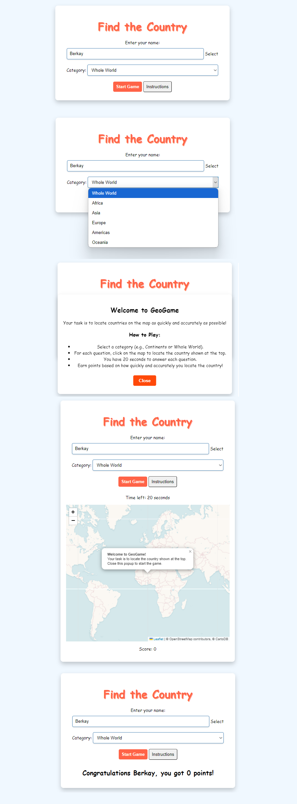

[](https://classroom.github.com/a/ATV5e7Id)

# Find the Country GeoGame

## Objective

The goal of "Find the Country" is to test players' geographic knowledge by having them locate specific countries on a map within a time limit. Players score points based on accuracy and speed.

## Link to the GeoGame

[Play the GeoGame](https://gmt-458-web-gis.github.io/geogame-Berkaynal/)

## Description

GeoGame is an interactive web-based game where players locate countries on a world map. The project uses **Leaflet.js**, a powerful JavaScript library, to create a dynamic and engaging mapping experience.

## Advanced JavaScript Library

### Leaflet.js

- **Purpose**: Used for creating interactive maps with smooth user interactions.
- **Features**:
  - Displaying map tiles.
  - Handling user clicks to identify countries.
  - Calculating distances and providing feedback.

## Requirements

- **Player Setup**: Enter a name to begin the game.
- **Interactive Map**: A map where players click on locations to answer questions. Country names are not displayed on the map.
- **Randomized Questions**: 10 random countries are selected from the chosen category.
- **Question Timer**: Each question has a 10-second timer.
- **Score Calculation**: Points are awarded based on the remaining time when a correct answer is given.
- **End Message**: Displays the final score after 10 questions.

## Game Flow

1. The player enters their name and clicks "Start Game."
2. The player selects a category (e.g., Africa, Europe, Asia, etc.).
3. The game randomly selects 10 countries from the chosen category.
4. For each question:
   - A random country name is presented, and a timer starts.
   - The player clicks on the map to select the location of the country.
   - If the player's click is within 500 km of the correct location, they earn points equal to the remaining time.
5. After 10 questions, a final message displays the player's name and total score.

## Key Features

- **Interactive Map**: Built using Leaflet.js for a seamless mapping experience.
- **Countdown Timer**: Adds urgency and excitement to the game.
- **Scoring System**: Rewards accuracy and speed.
- **Instructions Modal**: Provides a detailed explanation of how to play the game, which can be toggled on or off.
- **No Labels on Map**: The map uses a "no labels" tile layer to ensure country names are not visible.

## Event Handlers

Event handlers are functions that run in response to specific user interactions, making the game interactive and dynamic. The following event handlers are implemented in the project:

1. **Start Game Event**:
   - **Description**: This event initializes the game and sets up the map when the player clicks the "Start Game" button. It validates player input, selects a category, shuffles the countries, and displays the game interface.
   ```javascript
   startButton.addEventListener("click", function startGame() {
       playerName = playerNameInput.value.trim();
       if (playerName === "") {
           alert("Please enter your name to start the game!");
           return;
       }

       const selectedCategory = categorySelect.value;
       let countries = categories[selectedCategory];
       countries = shuffleArray(countries).slice(0, 10);
       mapElement.style.display = "block";
       nextQuestion(countries);
   });
   ```

2. **Show Instructions Event**:
   - **Description**: This event displays the instructions modal when the "Instructions" button is clicked, helping the player understand how to play the game.
   ```javascript
   showInstructionsButton.addEventListener("click", function () {
       instructionsContainer.style.display = "block";
   });
   ```

3. **Map Click Event**:
   - **Description**: This event captures clicks on the map, calculates the distance to the correct location, and determines if the player’s guess is accurate.
   ```javascript
   map.on("click", function (e) {
       const distance = map.distance(e.latlng, correctCoords);
       if (distance < 500000) {
           alert("Correct! You earned points.");
       } else {
           alert("Incorrect! Try again.");
       }
   });
   ```

## Closures

Closures are a fundamental concept in JavaScript that allow functions to access variables from an outer function even after the outer function has finished executing. In the GeoGame project, closures are used to maintain the game state (e.g., score, current question index) within the `startGame` function.

### Example of Closure:

```javascript
function startGame() {
    let questionIndex = 0;
    let score = 0;

    function nextQuestion(countries) {
        if (questionIndex >= countries.length) {
            alert(`Game Over! Your score: ${score}`);
            return;
        }
        const country = countries[questionIndex];
        countryQuestion.textContent = `Locate: ${country.name}`;
        questionIndex++;
    }

    nextQuestion(countries);
}
```

In this example, `nextQuestion` can access `questionIndex` and `score` because it is defined within `startGame`. This helps keep game logic encapsulated and prevents global variable pollution.

## DOM Interaction

DOM (Document Object Model) interaction is key to updating the game interface dynamically. The GeoGame project uses JavaScript to modify elements on the page based on user actions. Here are some examples:

1. **Updating the Question Text**:  
   Displays the name of the country the player needs to locate.
   ```javascript
   countryQuestion.textContent = "Locate: France";
   ```

2. **Showing Instructions**:  
   Displays the instructions modal when the player clicks the "Instructions" button.
   ```javascript
   instructionsContainer.style.display = "block";
   ```

3. **Displaying Game Elements**:  
   Shows the map, scoreboard, and question container when the game starts.
   ```javascript
   mapElement.style.display = "block";
   scoreboard.style.display = "block";
   questionContainer.style.display = "block";
   ```

## Deployment

The GeoGame project is deployed using **GitHub Pages**, making it accessible via a public URL. Here’s how the deployment process works:

1. **GitHub Repository**:  
   All project files (HTML, CSS, JavaScript, and assets) are stored in a GitHub repository.

2. **GitHub Pages Setup**:
   - In your repository, go to **Settings** > **Pages**.
   - Select the branch (usually `main` or `master`) and the folder (typically `/root`).
   - GitHub automatically generates a live website from your repository.

3. **Live URL**:  
   The project is available at:  
   [https://gmt-458-web-gis.github.io/geogame-Berkaynal/](https://gmt-458-web-gis.github.io/geogame-Berkaynal/)

This deployment method ensures the game is easily accessible and can be shared with others.

## Layout Diagram



