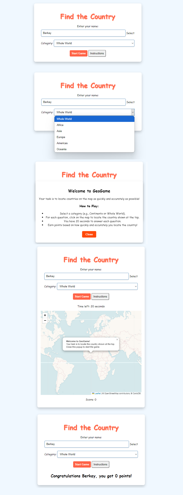

# Find the Country GeoGame

## Objective
The goal of "Find the Country" is to test players' geographic knowledge by having them locate specific countries on a map within a time limit. Players score points based on accuracy and speed.

## Requirements
- **Player Setup**: Enter a name to begin the game.
- **Interactive Map**: A map where players click on locations to answer questions.
- **Question Timer**: Each question has a 10-second timer.
- **Score Calculation**: Points are awarded based on remaining time when a correct answer is given.
- **End Message**: Displays the final score after 10 questions.

## Game Flow
1. The player enters their name and clicks "Start Game."
2. The game presents a random country name and a timer starts.
3. The player must click on the map where they think the country is located.
4. If the player’s click is within 500 km of the correct location, they earn points equal to the remaining time.
5. After 10 questions, a final message displays the player’s name and total score.

## Libraries Used
- **Leaflet.js**: For map rendering and interactive click detection.
- **JavaScript**: For game logic, timing, and scoring.

## Layout Diagram

